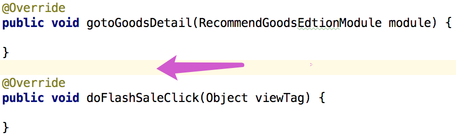

### 书写规范

#### 一，编码方式
<font color=red>1.【强制】</font> 编码方式统一 使用UTF-8。 

二，缩进统一
<font color=red>1.【强制】</font> 缩进统一为4个空格，将Tab size设置为4，可以保证tab键按4个空格缩进。另外，不要勾选上“Use tab character”，可以保证切换到不同tab长度的环境时，还能继续保持统一的4个空格的缩进样式


#### 三，括号使用
<font color=red>1.【强制】</font>  左大括号 { 禁止单独一行，和它前面的代码同一行。左大括号 { 与前面的代码之间用一个空格隔开。右大括号


#### 四，空格的使用

<font color=red>1.【强制】</font>if、else、for、switch、while等逻辑关键字与后面的语句留一个空格隔开


<font color=red>2.【强制】</font>运算符两边各用一个空格隔开


<font color=red>3.【强制】</font>方法的每个参数之间用一个空格隔开


#### 五，空行的使用

将逻辑相关的代码段用空行隔开，以提高可读性。空行一般只***\*空一行\****

<font color=red>1.【强制】</font>常量，成员变量，静态初始化块，构造函数，方法，嵌套类之间

<font color=red>2.【强制】</font>两个方法之间，正例



<font color=green>3.【建议】</font>方法内的两个逻辑段之间，正例


<font color=green>4.【建议】</font>方法内的局部变量和方法的第一条逻辑语句之间，正例


<font color=red>5.【强制】</font>页面的数据类型成员变量与控件类型成员变量之间，正例


#### 六，基准线

<font color=red>1.【强制】</font>当一个表达式无法容纳在一行内时，需换行显示。以Android Studio 分割线为基准线（默认100个字符，参考第8项），以“,”为下一行开始


<font color=red>2.【强制】</font>行宽设置为100，设置格式化时可自动断行到行宽位置


#### 七，变量声明

<font color=red>1.【强制】</font>一行声明一个变量，禁止一行声明多个变量，正例


#### 八，代码格式化

<font color=green>1.【建议】</font>使用快捷键进行代码自动格式化 ，没事常按按

a. Windows：CTRL+ALT+L

b. Mac：OPTION+COMMAND+L

#### 九，范围型常量

<font color=green>1.【建议】</font>范围型的常量用枚举类定义，不建议使用整型或字符，可以减少范围值的有效性检查。PS：在特殊情况下，可使用整型或字符串代替枚举。


#### 十，函数

<font color=red>1.【强制】</font>一个函数最多不要超过40行代码。

#### 十一，像素单位

<font color=red>1.【强制】</font>文字大小的单位统一用sp，视图高宽间距的单位统一用dp，特殊情况下使用px

#### 十二，资源文件

<font color=red>1.【强制】</font>应用中的字符串统一在strings.xml中定义，便于多语言管理

<font color=red>2.【强制】</font>颜色统一在colors.xml中定义。禁止在代码和布局文件中引用系统的颜色（除透明外）。

#### 十三，Java类成员书写顺序

<font color=red>1.【强制】</font>Java类成员书写顺序：

```
普通Java类顺序：
	常量
	变量
	构造函数
	静态块
	@Override函数
	其它函数
	内部类、接口
	
特殊类 ‐‐ 数据类（Bean、Model） 数据类型顺序：
	常量
	变量
	构造函数
	一般函数 (包括静态)
	getter、setter
	序列化
	
特殊Java类 ‐‐ UI类（Activity、Fragment、Dialog等）顺序：
	常量
	UI控件成员变量
	普通成员变量
	构造函数
	初始化函数 （即：初始化过程函数，如：initVariable()，initView() 等)

	页面 (Activiy、Fragment 等) 生命周期函数（如：onStart()、onActivityResult() 等）
	普通函数平级
	事件响应函数 （如：onClick()、onItemClick() 等）
	@Override的逻辑函数
	普通逻辑函数
	内部类、接口、成员变量new click相关事件（如：new OnRecyclerItemClickListener(), new 	    Toolbar.OnMenuItemClickListener() 等）
```

