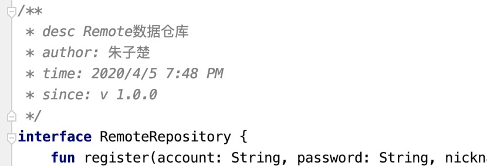
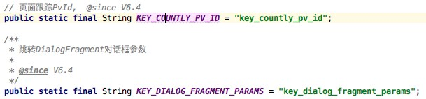
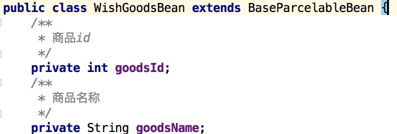
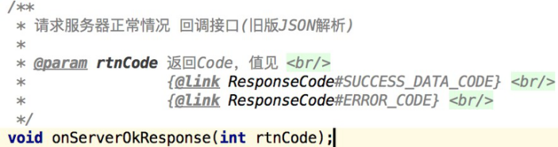

### 注释规范

#### 一，类和接口
1.【强制】 头部信息注释依次为:desc(描述)、author(作者)、time(时间)、since(从哪个版本号创建)，注意空格隔开。

#### 二，变量和常量

1.【强制】 成员变量和常量，必须添加注释说明。优先采用***\*区块注释\*******\*/\*\* \*/\****。如果文件内容篇幅过大，可采用***\*单行\*******\*//\****注释（放在常量上）：

2.【强制】 纯实体类Bean, Model的属性，强烈建议采用区块注释

#### 三，一般方法

1.【强制】 下面几种方法，必须添加简单注释 (包括：参数、返回值）

a 接口中定义的所有方法。

b 类public、protected方法（特别是工具类）

2.【建议】 类私有方法，通过函数名称直接反应具体内容，可不加注释。复杂、关键、参数较多的函数，建议加上简短注释。

#### 四，函数参数

1.【建议】 公认的参数无需加注释，如Context。

2.【强制】 范围常量值需标注应有的范围常量。如下图rtnCode参数注释：

3.【强制】 其它类型参数需加注释。

#### 五，其他注释建议

1.【建议】 strings.xml，按照所属页面、功能有序存放，使用 <!‐‐ ‐‐> 简单注释标注。

1.【建议】 函数参数和结果返回，尽量使用@Nullable 、@NonNull注解。