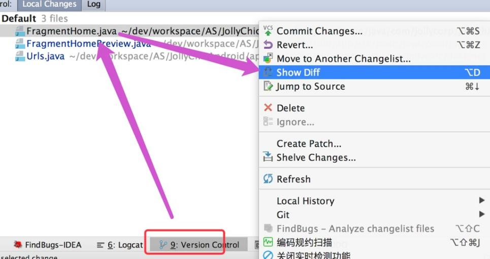
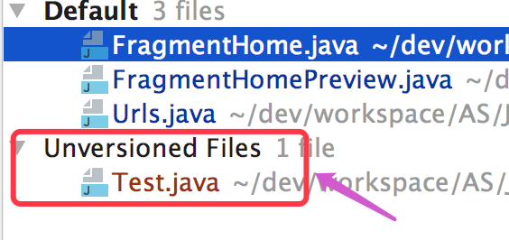
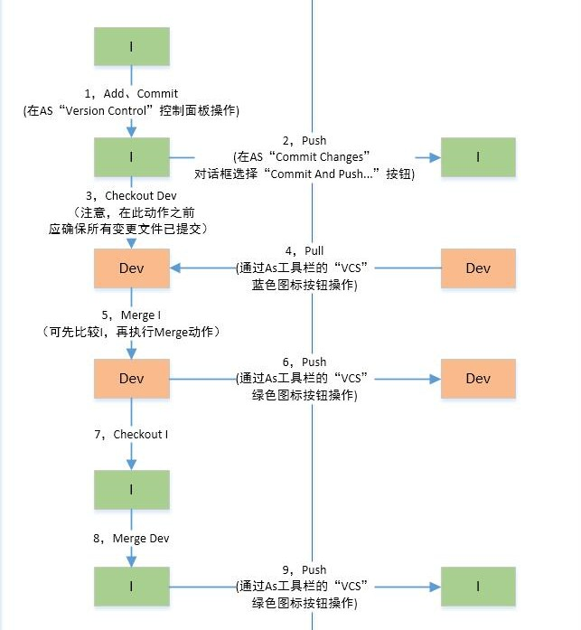

### Git操作规范

#### 一，控制提交内容粒度
1.【强制】 每次Commit的内容应该有高度相关性和独立性。例如：一个小功能或一个小改进。如果同时在做新功能和修旧Bug，那么就应该分开两次递交。切勿多个功能改动大批量提交。

#### 二，核实代码变更

1.【强制】 Commit前必须依次核实每个文件的每处代码变更。减少误修改、误删除、不必要调试日志的情况

#### 三，不允许的Commit情况

1.【强制】 编译无法通过的代码不应该Commit，以免影响他人开发。有两种办法可以避免

a：Commit前需要Rebuild代码

b：检查新建文件是否提交

#### 四，Commit注释

1.【强制】 Commit注释的内容要与本次代码修改内容一致，禁止胡乱编写。

#### 五，当日提交代码

1.【强制】 代码在不影响他人开发的情况下，当日下班前需提交代码到服务器

#### 六，大批量代码操作

1.【强制】 大批量增删修改代码，需要特别注意，因为极有可能影响其他人。譬如：正在重名名一个正在被其他人员修改的文件，很可能导致代码有问题。采取措施如下：

a：改动前，通知其他开发人员。

b：协商无争议后，更新最新库代码。

c：尽快修改（不宜拖较长时间，建议不超过2个小时）。

d：修改完成后，通知其他研发人员，无争议后提交。

#### 七，及时Pull代码

1.【强制】 及时Pull代码。

a：正在参与开发的项目，每日更新最新分支代码不低于一次。

b：他人大批量提交代码后需请及时更新，避免大面积冲突。

#### 八，Git Merge 代码流程

1.【强制】 Git Merge 代码流程。

“I“代表个人分支，“Dev”代表版本分支，这两个分支在本地、远程都存在的情况。

合并代码过程中，如果遇到冲突，谨慎操作。如果不了解操作过程，可以@内部群寻求帮助，切勿覆盖他人代码！

#### 九，精简本地分支

1.【建议】 本地分支列表（Local Branches）建议保持简洁。多个版本同时迭代开发，建议只保留最近开发的1、2个版本分支），避免代码合并错误。

#### 十，分支命名

1.【强制】 分支命名。

a：个人分支命名

格式：“分支标识”_“版本号”，个人标识首字母需大写。如："zhuzicvhu_6.9" 表示：zhuzichu  6.9 分支。

b：版本分支

格式：“dev"_"版本号"。如：dev_6.9。

注意：不同单词使用“_”分割。