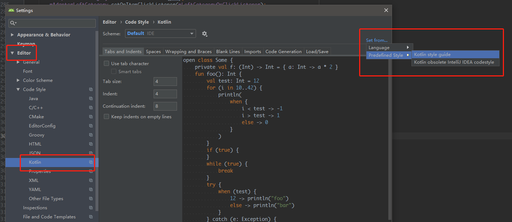

### Kotlin格式规范

#### 一、统一格式编码
<font color=red>1.【强制】</font>



#### 二、空格格式化

<font color=red>1.【强制】</font>在二元操作符左右留空格

<font color=green>正例：</font>`（a + b）`

<font color=orange>反例：</font>`（a+b）`

<font color=red>2.【强制】</font>在控制流关键字（if、 when、 for 以及 while）与相应的左括号之间留空格。

<font color=green>正例：</font>

```
if (elements != null) {
    for (element in elements) {
        // ……
    }
}
```

<font color=orange>反例：</font>

```
if(elements != null){
    for(element in elements){
        // ……
    }
}
```

<font color=green>3.【建议】</font>在 // 之后留一个空格：

<font color=green>正例：</font>`// 这是一条注释`

<font color=orange>反例：</font>`//这是一条注释`

<font color=red>4.【强制】</font>不要在“range to”操作符左右留空格。

<font color=green>正例：</font>`(0..i)`

<font color=orange>反例：</font>`(0 .. i)`

<font color=red>5.【强制】</font>区间上循环，使用 `until` 函数在一个区间上循环：

<font color=green>正例：</font>
`for (i in 0 until n) { …… } ` 

<font color=orange>反例：</font>
`for (i in 0..n - 1) { …… }`  

<font color=red>6.【强制】</font> 不要在一元运算符左右留空格

<font color=green>正例：</font>`(a++)`

<font color=orange>反例：</font>`(a ++ )`

<font color=red>7.【强制】</font> 不要在主构造函数声明、方法声明或者方法调用的左括号之前留空格。


```
案例1
// good
class A(val x: Int)

// bad
class A (val x: Int)
```

```
案例2
// good
fun foo(x: Int) { ... }

// bad
fun foo (x: Int) {...}
```

```
案例3
// good
fun bar() {
    foo(1)
}

// bad
fun bar() {
    foo (1)
}
```

<font color=red>8.【强制】</font> 不要在用于指定类型参数的尖括号前留空格：

<font color=green>正例：</font>
`class Map<K, V> { …… }`

<font color=orange>反例：</font>
`class Map <K, V> { …… }`

<font color=red>9.【强制】</font> 不要在 `::` 前后留空格：

<font color=green>正例：</font>
`Foo::class`、 `String::length`

<font color=orange>反例：</font>
`Foo :: class`、 `String :: length`

<font color=red>10.【强制】</font> 不要在用于标记可空类型的 ? 前留空格：

<font color=green>正例：</font>
`String?`

<font color=orange>反例：</font>
`String ?`

注意：对于非空判断时，尽量使用``?.``，不建议使用``!!``

<font color=red>11.【强制】</font> 绝不在 `(、[ `之后或者 `]、)` 之前留空格。

<font color=green>正例：</font>`if (true) ` `int[i]`

<font color=orange>反例：</font>`if( true ) ` `int[ i ]`

<font color=red>12.【强制】</font> 绝不在`.` 或者 `?.` 左右留空格：

<font color=green>正例：</font>
`foo.bar().filter { it > 2 }.joinToString(), foo?.bar()`

<font color=orange>反例：</font>
`foo.bar() . filter { it > 2 }.joinToString(), foo ?. bar()`

#### 三、冒号格式化

 <font color=red>1.【强制】</font>在`:`前后都留空格

  - 当它用于分隔类型与超类型时；

   <font color=green>正例：</font>
  `class FragmentAccount : FragmentAnalyticsBase`

   <font color=orange>反例：</font>
    `class FragmentAccount: FragmentAnalyticsBase`

  - 当委托给一个超类的构造函数或者同一类的另一个构造函数时；

  	<font color=green>正例：</font>
  	
  	```
  	class Fruit(name: String) { // 主构造函数
    	constructor(name: String, leve: String) : this(name) {}
   }
  	```
  	  <font color=orange>反例：</font>
  	  
   ```
  	class Fruit(name: String) { // 主构造函数
    	constructor(name: String, leve: String): this(name) {}
   }
   ```

  - 在 object 关键字之后。

	<font color=green>正例：</font>

	```
 	private var onTabSelectedListener =
        object : BottomNavigationBar.SimpleOnTabSelectedListener() {}
	```
	
	 <font color=orange>反例：</font>
	
	```
 	private var onTabSelectedListener =
        object: BottomNavigationBar.SimpleOnTabSelectedListener() {}
	```

<font color=red>2.【强制】</font> 在 `:` 后留一个空格。

 <font color=green>正例：</font> 当分隔声明与其类型时
`val number: Int`

 <font color=green>正例：</font> 当声明函数返回类型时
`fun foo(a: Int): Boolean`
```

#### 四、类头格式化

<font color=red>1.【强制】</font> 一行可以容纳时，不换行(不超过Android Studio宽度基准线)：

<font color=green>正例：</font>

```
class Person(id: Int, name: String)

```
<font color=red>2.【强制】</font>当较长无法在一行内容纳时，应该格式化 (超过Android Studio宽度基准线)：

- 每个主构造函数参数都在带有缩进的独立行中
- 右括号应该位于一个新行上
- 如果使用继承或实现，应与右括号位于同一行

<font color=green>正例：</font>

```
class Person(
    id: Int,
    name: String,
    surname: String,
    age: Int
) : Human(id, name),
    KotlinMaker { …… }
```
若未超出 Android Studio 宽度基准线，参数也可写在一行

<font color=green>正例：</font>

```
class Person(
    id: Int, name: String, surname: String
) : Human(id, name),
    KotlinMaker { …… }
```
构造函数参数使用常规缩进（4 个空格）

> 理由：这确保了在主构造函数中声明的属性与 在类体中声明的属性具有相同的缩进。

<font color=red>
3.【强制】</font>对于具有很长超类型列表的类，在冒号后面换行，并横向对齐所有超类型名：

<font color=green>正例：</font>

```
class MyFavouriteVeryLongClassHolder :
    MyLongHolder<MyFavouriteVeryLongClass>(),
    SomeOtherInterface,
    AndAnotherOne，
    View.OnClickListener {

    fun foo() { ... }
}
```

#### 五、属性格式化

<font color=green>1.【建议】 </font>对于非常简单的只读属性，优先使用单行格式：

<font color=green>正例：</font>

```
val isEmpty: Boolean get() = size == 0
```

<font color=green>2.【建议】</font>对于更复杂的属性，将 get 与 set 关键字放在不同的行上：

```
val foo: String
    get() { …… }
```


#### 六、函数格式化

<font color=red>1.【强制】</font>如果函数参数不适合单行，请使用以下语法:

```
fun longMethodName(
    argument: ArgumentType = defaultValue,
    argument2: AnotherArgumentType
): ReturnType {
    // 函数体
}
```

函数参数使用常规缩进（4 个空格）

>理由：与构造函数参数一致


<font color=red>2.【强制】 </font>对于由单个表达式构成的函数体，优先使用表达式形式。

<font color=green>正例：</font>

```
fun foo() = 1       

```

<font color=orange>反例：</font>

```
fun foo(): Int {    
    return 1 
}
```

#### 七、表达式函数体格式化

<font color=red>1.【强制】</font>如果函数的表达式函数体与函数声明不适合放在同一行，那么将 = 留在第一行。 将表达式函数体缩进 4 个空格。

<font color=green>正例：</font>

```
 override fun getTagClassName(): String =
 	 currentFragment?.tagClassName ?: ActivityMain::class.java.simpleName
```

<font color=green>2.【建议】 </font>. 使用作用域函数 apply/with/run/also/let
Kotlin 提供了一系列用来在给定对象上下文中执行代码块的函数：`let`、 `run`、 `with`、 `apply` 以及 `also`。 关于不同情况下选择正确作用域函数的准则，请参考[作用域函数](https://www.kotlincn.net/docs/reference/scope-functions.html)

#### 八、方法调用格式化

<font color=green>1.【建议】 </font> 在较长参数列表的左括号后添加一个换行符。按 4 个空格缩进参数。 将密切相关的多个参数分在同一行。

<font color=green>正例：</font>

```
drawSquare(
    x = 10, y = 10,
    width = 100, height = 100,
    fill = true
)
```

在分隔参数名与值的 = 左右留空格。

#### 九、链式调用换行
<font color=red>1.【强制】 </font> 当对链式调用换行时，将 `. `字符或者` ?. `操作符放在下一行，并带有单倍缩进：

<font color=green>正例：</font>

```
val anchor = owner
    ?.firstChild!!
    .siblings(forward = true)
    .dropWhile { it is PsiComment || it is PsiWhiteSpace }
```

调用链的第一个调用通常在换行之前，如果能让代码更有意义可以忽略这点。

#### 十、Lambda 表达式格式化

<font color=red>1.【强制】 </font> 在 lambda 表达式中，应该在花括号左右以及分隔参数与代码体的箭头左右留空格。 如果一个调用接受单个 lambda 表达式，应该尽可能将其放在圆括号外边传入。

<font color=green>正例：</font>

```
list.filter { it > 10 }
```

<font color=red>2.【强制】 </font> 如果为 lambda 表达式分配一个标签，那么不要在该标签与左花括号之间留空格：

<font color=green>正例：</font>

```
fun foo() {
    ints.forEach lit@{
        // ……
    }
}
```

<font color=red>3.【强制】</font>在多行的 lambda 表达式中声明参数名时，将参数名放在第一行，后跟箭头与换行符：

<font color=green>正例：</font>

```
appendCommaSeparated(properties) { prop ->
    val propertyValue = prop.get(obj)  // ……
}
```

<font color=red>4.【强制】</font> 如果参数列表太长而无法放在一行上，请将箭头放在单独一行：

<font color=green>正例：</font>

```
foo {
   context: Context,
   environment: Env
   ->
   context.configureEnv(environment)
}
```

#### 十一、控制流语句格式化

<font color=red>1.【强制】 </font> 判断条件简短且返回值明了，建议使用一行

<font color=green>正例：</font>

```
案例1
// Good
if (iBaseView == null) return
     
// Bad
if (iBaseView == null) {
    return
}
```

```
案例2  
// Good
if (iBaseView == null) 1 else 0
     
// Bad
if (iBaseView == null) {
    1
 } else {
    0
 }
```
> 理由：对齐整齐并且将条件与语句体分隔清楚

将 `else、 catch、 finally `关键字以及 `do/while` 循环的` while` 关键字与之前的花括号放在相同的行上：

<font color=green>正例：</font>

```
if (condition) {
    // 主体
} else {
    // else 部分
}
​
try {
    // 主体
} finally {
    // 清理
}

```
<font color=green>2.【建议】 </font>多条件判断且一行无法容纳，建议每个条件换行，条件语句起始处缩进 4 个空格，右括号与左大括号单独放在一行：

<font color=green>正例：</font>

```
if (!component.isSyncing &&
    !hasAnyKotlinRuntimeInScope(module)
) {
    return createKotlinNotConfiguredPanel(module)
}
```
<font color=red>3.【强制】</font>在 when 语句中，如果一个分支不止一行，用注释将其与相邻的分支块分开：

<font color=green>正例：</font>

```
override fun onViewClick(view: View) {
    when (view.id) {
        // 检查菜单项
        R.id.container -> checkMenu(view)
        // 点击完成
        R.id.finish -> finish()      
    }
}

```

<font color=red>4.【强制】 </font> 在`when`语句中，针对简短代码(不超过基准线)，将段分支放在与条件相同的行上，无需大括号：

```
// good
override fun onViewClick(v: View) {
    when (v.id) {
		  // 返回
         R.id.rl_title_left -> processBack()
         // 删除
         R.id.btn_wish_delete -> showDeleteDialog()
         // Go Shopping
         R.id.tvGoShopping -> BusinessHome.goBackOrJumpInSideForMain(
             this,
             BottomViewPathRange.HOME
         )
    }
}

// bad
 override fun onViewClick(v: View) {
     when (v.id) {
          // 返回
          R.id.rl_title_lefy -> {
              processBack()
			}
          // 删除
          R.id.btn_wish_delete -> {
              showDeleteDialog()
          }
          // Go Shopping
          R.id.tvGoShopping -> BusinessHome.goBackOrJumpInSideForMain(this, BottomViewPathRange.HOME)
     }
 }

```

<font color=red>5.【强制】 </font>`if`中的条件注释，写在每个括号内部：
>     // Good
>     if (v.id == btn_wish_delete) {
>         // 删除
>     }
>     
>     // Bad
>     if (v.id == btn_wish_delete) {// 删除
>         
>     }
>    

<font color=green>6.【建议】 </font> 优先使用`if`、`when`的表达式形式：

>     // Good
>     return if (x) foo() else bar()
>     
>     // Bad
>     if (x) {
>         return foo()
>     } else {
>         return bar()
>     }
>
>     // Good
>     return when(x) {
>         0 -> "zero"
>         1 -> "one"
>         else -"nonzero"
>     }
>     
>     // Bad
>     when(x) {
>         0 -> return "zero"
>         1 -> return "one"
>         else -> return "nonzero"
>     }
> 

<font color=green>7.【建议】 </font> 二元条件优先使用`if`，三个或更多选项是优先使用`when`:
>     // Good
>     if (x == null) …… else ……
>     
>     // Bad
>     when (x) {
>         null -> ……
>         else -> ……
>     }
>     
>     // Good
>     when {
>         x > 0 -> ……
>         x == 0 -> ……
>         else -> ……
>     }
>    
>     // Bad
>     if (x > 0) {
>         ……
>     } else if (x == 0) {
>         ……
>     } else {
>         ……
>     }   

#### 十二、修饰符
<font color=red>1.【强制】 </font>如果一个声明有多个修饰符，请始终按照以下顺序安放：

```
public / protected / private / internal
expect / actual
final / open / abstract / sealed / const
external
override
lateinit
tailrec
vararg
suspend
inner
enum / annotation
companion
inline
infix
operator
data
```

#### 十三、注解格式化

<font color=red>1.【强制】</font> 注解放在单独行上，在它们所依附的声明之前，并使用相同的缩进

<font color=green>正例：</font>

```
@Target(AnnotationTarget.PROPERTY)
annotation class JsonExclude
```

<font color=red>2.【强制】</font> 无参数的注解可以放在同一行：

<font color=green>正例：</font>

```
@JsonExclude @JvmField
var x: String
```

#### 十四、文件注解格式化

<font color=red>1.【强制】 </font>文件注解位于文件注释（如果有的话）之后、package 语句之前，并且用一个空白行与 package 分开 （为了强调其针对文件而不是包）

```
/** 授权许可、版权以及任何其他内容 */
@file:JvmName("FooBar")

package foo.bar
```

